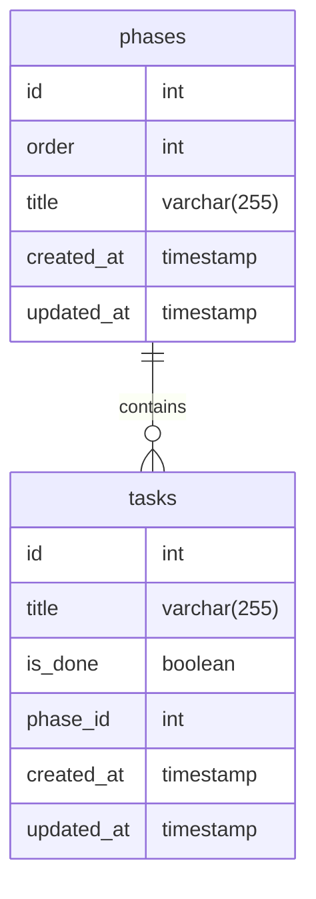

# Startup Stages

[](https://sonarcloud.io/summary/new_code?id=jonathas_startup-stages)
[](https://sonarcloud.io/component_measures/metric/reliability_rating/list?id=jonathas_startup-stages)
[](https://sonarcloud.io/component_measures/metric/security_rating/list?id=Cjonathas_startup-stages)

A GraphQL API for documenting the stages and steps that a startup needs to go through


## Features

- Every phase can have an unlimited amount of tasks
- If the startup accomplishes all tasks in the phase, it's marked as done and unlocks the next phase
- Tasks cannot be marked as completed unless all tasks in the previous phase were completed
- It's possible to reopen (undo) a task

## Tech

- Node.js
- GraphQL (Apollo)
- TypeScript
- Fastify
- Nexus

## Installation

```bash
$ npm install
```

## Running the project

You can run the project in development mode with live-reloading using the following command:

```bash
$ npm run start:dev
```

For production the following should be run:

```bash
$ npm start
```

## Running the tests

You can run the unit tests with the following command:

```bash
$ npm t
```

For generating a code coverage report:

```bash
$ npm run test:cov
```

## Way of working

The [husky](https://www.npmjs.com/package/husky) lib is used for enforcing some rules for local development using Git hooks.

- On every commit:
  - The commit message is validated against [Conventional Commits](https://www.conventionalcommits.org/en/v1.0.0/)
  - The staged files are linted with several [eslint](https://www.npmjs.com/package/eslint) rules
- Before every push to the repository, the unit tests will run and should pass for the push to proceed.

## Database

The diagram below is parsed via [mermaid](https://mermaid.js.org/syntax/entityRelationshipDiagram.html).



## Accessing the API

### Postman collection

A [Postman](https://www.postman.com/downloads/) collection can be found inside of the docs directory. You can just import it to Postman and start using it to interact with the API.

### Apollo Sandbox

You can also use Apollo Sandbox for acessing the API. Just run the project in development mode and then access http://localhost:3000/graphql in the browser


## Known limitations

- The progress is currently only saved in memory (not database)
- There's no pagination
